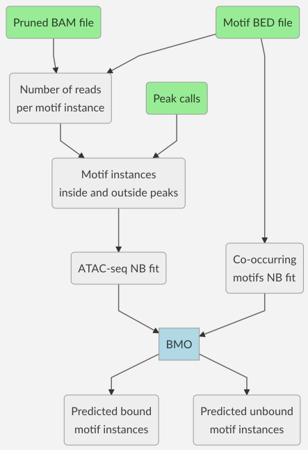

# ParkerLab BMO

# Overview
BMO (pronounced *beemo*) is an algorithm to predict TF binding from ATAC-seq data without using footprints. BMO uses negative binomial models of ATAC-seq fragments and number of co-occurring motifs to determine the likelihood of a given motif instance being bound. More details about the model can be found in our manuscript:

[Chromatin information content landscapes inform transcription factor and DNA interactions](https://doi.org/10.1101/777532)

**Disclaimer**: BMO has only been tested with paired-end ATAC-seq data.

**Platforms tested**: Linux (Debian 9), macOS (10.13)


# Required input
1. ATAC-seq experiment processed <sup>1</sup> and indexed BAM file
2. ATAC-seq peak calls <sup>2</sup>
3. Motif BED6 <sup>3</sup> files. One file per PWM scan <sup>4</sup>

<sup>1</sup> We recommend high quality (MAPQ ≥ 30), autosomal, duplicate removed (we use [Picard](https://broadinstitute.github.io/picard/)), properly paired, and uniquely mapped reads only (SAM [flags](https://broadinstitute.github.io/picard/explain-flags.html) `-f 3 -F 4 -F 8 -F 256 -F 1024 -F 2048`). If you don't have an ATAC-seq pipeline set up yet, you should consider using the [Parker Lab ATAC-seq Snakemake pipeline](https://github.com/ParkerLab/ATACseq-Snakemake).

<sup>2</sup> We call them with [MACS2](https://github.com/taoliu/MACS), using flags `--broad --nomodel --shift -100 --extsize 200 --keep-dup all` and then intersect out [blacklisted regions](https://sites.google.com/site/anshulkundaje/projects/blacklists).

<sup>3</sup> Mandatory. Pipeline will crash otherwise.

<sup>4</sup> We use [FIMO](http://meme-suite.org/doc/fimo.html).


# Algorithm overview



# Installation
From your machine run the command below wherever you want BMO's main directory to be (*e.g.* `~/software`).
```sh
git clone https://github.com/ParkerLab/BMO.git
```

# Running BMO
## Using Snakemake
We strongly recommend you run BMO using [Snakemake](https://snakemake.readthedocs.io), an extremely powerful tool for running reproducible pipelines. 

### 1) Create and activate BMO conda environment (optional)
**Requirements**: Having a working [Anaconda](https://docs.anaconda.com/anaconda/install/) or [Miniconda](https://conda.io/docs/user-guide/install/index.html) installation in your system.

#### Using the provided conda environment
If you do not have Snakemake installed, don't have administrative privileges in your machine/cluster, or don't want to overwrite anything in your main environment, we provide a separate [conda environment](https://conda.io/docs/user-guide/tasks/manage-environments.html) with everything you need to get started (it's actually just a barebones python 3 with Snakemake, pysam, and R installed). To create the environment, run the command below from wherever you cloned BMO:
```sh
conda env create -f conda/environment.yml
```
It may take a some time to run, but you only have to do this once. 

Now you can activate your environment. **This is the only step you need to do every time you want to run BMO**.
```sh
source activate BMO_env
```
With your environment activated for the first time, you need to install the R dependencies that can't be automatically included. You only need to do this once.
```sh
Rscript conda/install_R_dependencies.R
```
You are now ready to run BMO.

#### Or manually creating your own environment
Some users reported an [issue](https://github.com/ContinuumIO/anaconda-issues/issues/9480) with conda where the environment creation from a file fails with a `ResolvePackageNotFound` error. If you encountered this or any error trying to use the provided environment file, you can manually create BMO environment by running:
```
# Create and activate environment
conda create --name BMO_env
source activate BMO_env

# Install Snakemake and pysam
conda install -c bioconda -c conda-forge snakemake
conda config --add channels defaults
conda config --add channels conda-forge
conda config --add channels bioconda
conda install pysam

# Install R and dependencies
conda install r-essentials
Rscript conda/install_R_dependencies.R
```

### 2) Setting up the Snakemake configuration file
Our Snakemake pipeline makes use of a configuration file, which includes information of paths and input files. The template is located in `config/config.yaml`. Let's go through each of the fields:
* **`bmo_dir`**: this is the folder where you cloned this repository.
* **`motif_dir`**: path to your motif BED6 files.
* **`motif_ext`**: extension associated with the motif files. Do not add a dot in the beginning (*e.g.* use `bed.gz` instead of `.bed.gz`).
* **`motif_file`**: plain text file containing the list of motif names (no paths or extensions), one per line.
* **`results`**: directory where the output will be saved.
* **`ionice`**: a string to append before each command call to set disk/CPU priority (*e.g.* `ionice -c2 -n7`). For Mac users: `ionice` is not supported in macOS, so the default value should be set to blank or `""`.
* **`use_shm`**: *True* or *False*. For some of the I/O heavy steps, BMO can use a shared memory partition (*i.e.* RAM that behave as disk space, like `/dev/shm`). This can increase BMO's concurrency when submitting jobs on a single machine with >10Gb of RAM to spare. Can also be used to send jobs to a SSD partition, instead. Only use this option if you know what you are doing.
* **`shm_dir`**: path for shared memory operations if `use_shm: True`.
* **`samples`**: information about each ATAC-seq experiment to be processed. The `bamfile` and `peakfile` fields under each sample handle are mandatory and point to the experiment's BAM and peak calls, respectively. Attention: make sure that the sample handles (main identation of each sample) are **unique**.

IMPORTANT: Because the config is a [yaml](http://yaml.org) file, **make sure to maintain all the indentations as they appear** or unexpected behaviors may occur.

### 3) Running BMO pipeline in Snakemake
To execute the pipeline, you need to copy both the `Snakefile` and `input/config.yaml` to wherever you want to run the analysis in your machine/cluster and then update the config file as described in the previous section. After that, just run the code below and Snakemake will take care of the rest. Simple as that.

```
snakemake [-j {threads}] [--resources io_limit={concurrency}] --configfile config.yaml
```
* Flags in [brackets] are optional.
* **`{threads}`** is an integer value for the total number of cores Snakemake is allowed to use. if running on a HPC cluster, then set to 999 or some arbitrarily high value.
* **`{concurrency}`** is also an integer, and determines the number of maximum I/O intensive jobs to run simultaneously (we recommend starting with 1-3 and keeping an eye on the `%iowait` column of `sar` to see how much your machine can handle). Alternatively, the high I/O jobs can be pushed to RAM or to an SSD partition by changing `use_shm: True` in the config file (see details in the previous section). If using the latter option, then also add `shm_limit={shm_concurrency}` to the `--resources` call above, where `{shm_concurrency}` is an integer for the maximum number of concurring jobs when using the RAM/SSD partition. If either `io_limit` or `shm_limit` are not set, then all jobs will be submitted with no regards to maximum concurrency (which should not be an issue if running in a cluster).

### 4) Running the example data
We included some example data at `examples`. It consists of a heavily downsampled chromosome 1 of one of the Buenrostro *et al* 2013<sup>[1]</sup> original GM12878 ATAC-seq samples and chromosomes 1 of our CTCF_known2 and ELF1_known1 motif scans. The example also includes a config file, which we will use to instruct Snakemake. To run the example, execute the code below.
```sh
source activate BMO_env #optional
snakemake -j 4 --configfile examples/example_config.yaml
```

[1] doi: 10.1038/nmeth.2688

## Manually (standalone version)
*Coming soon*

## Run time and memory requirements
The expected run time will vary depending on the size of your input files. As an example, a relatively large motif file (\~400K instances) running on a very large BAM file (\~80M reads) takes less than 5 minutes and 500Mb of RAM using 4 cores. The same motif file takes less than 2 minutes and the same amount of RAM to run on a smaller BAM file (\~35M reads) using the same number of cores.

# Interpreting BMO results
## Processed BED files
Once the pipeline finishes running, you can find results in the `work/bmo/{sample}/bound` folder. The BED6 files there will correspond to the **predicted bound motif instances** for each motif.

1. Chromosome name
2. Start position
3. End position
4. Feature name
5. BMO score (-log<sub>10</sub> adjusted *p*-value)
6. Strand


## Full output
If you want to use different filtering thresholds than our defaults, then look for the files at `work/bmo/{sample}/all`. The output is as described below:

1. Chromosome name
2. Start position
3. End position
4. Feature name
5. Feature score (*e.g.* FIMO score)
6. Strand
7. Number of ATAC-seq fragments in feature vicinity
8. Number of co-occurring motifs in feature vicinity
9. ATAC-seq fragments negative bionomial *p*-value
10. Co-occurring negative bionomial motifs *p*-value
11. Combined *p*-value
12. Adjusted combined *p*-value (using Benjamini-Yekutieli)
13. BMO score (-log<sub>10</sub> adjusted *p*-value)
14. Predicted bound 0/1 (1 is *yes*)